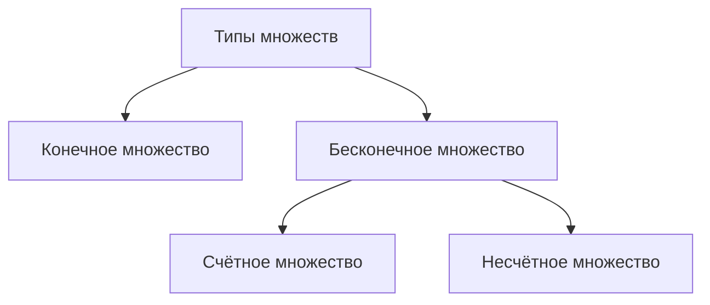
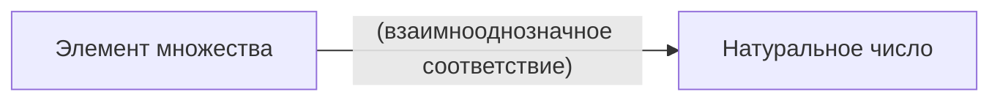
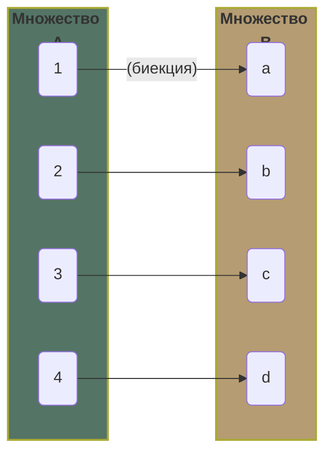

# Анализ 1

Это актуальные билеты по сессии в СУНЦ МГУ.
Надеюсь, что они помогут вам сдать экзамен.

> **Внимание!**
>
> Это не конспект лекций, а билеты по сессии. Некоторые темы могут быть не раскрыты полностью,
> поэтому рекомендую использовать их в качестве подготовки к экзамену.
>
{style="warning"}

## 1. Множества

### 1.1. Определение множества

<tabs>

<tab title="Множество">
Это совокупность различных объектов, называемых элементами множества.

При этом вся совокупность воспринимается как единое целое.


</tab>

<tab title="Числовое множество">
Это множество, элементами которого являются числа.

</tab>

</tabs>

<tip>
Множество обычно обозначается заглавными буквами, однако опционально можно использовать
<emphasis>blackboard bold</emphasis> шрифт.

```tex
\begin{align}
&\mathbb{BLACKBOARD\ BOLD}\Rightarrow\mathbb{A}&\\
&DEFAULT\Rightarrow{A}&
\end{align}
```

</tip>

### 1.2. Типы множеств

Общая диаграмма типов множеств:



<tabs>
<tab title="Конечные">
В конечном множестве количество элементов <emphasis>конечно</emphasis>. В таком множестве однозначно
можно найти последний и первый элементы.

Например, множество натуральных чисел от 1 до 10.

<procedure>

```tex
\mathbb{A}= \{a_1, a_2, \ldots, a_n\}
```

</procedure>
</tab>
<tab title="Бесконечные">
В бесконечном множестве количество элементов <emphasis>бесконечно</emphasis>. В таком множестве нельзя найти или
последний, или первый элементы.

Например, множество натуральных чисел, так как их бесконечно много.

<procedure>

```tex
\mathbb{A}= \{a_1, a_2, \ldots\}
```

</procedure>
</tab>
<tab title="Счётные">
В счётном множестве можно последовательно перечислять элементы (первый, второй, третий, ...).

<procedure title="Точная формулировка (для ботанов)" collapsible="true">

<emphasis>Счётное множество</emphasis> - множество, в котором можно установить взаимнооднозначное
соответствие (биекция) между элементами этого множества и множества натуральных
чисел. (При биективном отображении каждому элементу одного множества соответствует
ровно один элемент другого множества, при этом определено обратное отображение,
которое обладает тем же свойством.)



</procedure>

<note>

Из стандартных множеств счётными являются:

```tex
\mathbb{N}, \mathbb{Z}, \mathbb{Q}
```

</note>

</tab>
<tab title="Несчётные">
В несчётном множестве нельзя последовательно перечислять элементы (первый, второй, третий, ...).

<procedure title="Точная формулировка (для ботанов)" collapsible="true">

<emphasis>Несчётное множество</emphasis> - множество, которое нельзя упорядочить в
виде последовательности, в которой каждый элемент имеет свой номер.

</procedure>

<note>
Из стандартных множеств несчётными являются:

```tex
\mathbb{R}, \mathbb{C}
```

</note>
</tab>
</tabs>

### 1.3. Стандартные множества

Здесь представлены лишь самые базовые множества, которые вам понадобятся на экзамене.

<procedure collapsible="true" title="Принято обозначать стандартные множества следующим образом:">

```tex
\begin{align}
\begin{array}{ll}
\mathbb{N}=\{1, 2, 3, \ldots\} \\
\mathbb{Z}=\{\ldots, -2, -1, 0, 1, 2, \ldots\} \\
\mathbb{Q}=\left\{\frac{m}{n} \mid m \in \mathbb{Z}, n \in \mathbb{N}\right\} \\
\mathbb{R}=(-\infty, +\infty) \\
\mathbb{C}=\{a+bi \mid a, b \in \mathbb{R}, i^2=-1\}
\end{array}
\end{align}
```

</procedure>

<tip>
Иногда мы используем следующие множества:

```tex
\begin{align}
&\varnothing=\{\}& \texttt{(пустое множество)} \\
&\mathbb{P}=\{2, 3, 5, 7, 11, \ldots\} & \texttt{(множество простых чисел)} \\
&\mathbb{N}\setminus\mathbb{P}\setminus\{1\}=\{4, 6, 8, 9, 10, \ldots\} & \texttt{(множество составных чисел)}
\end{align}
```

</tip>

### 1.4.0. Универсальное множество

<emphasis>Универсальное множество</emphasis> — это множество, содержащее все объекты и все множества.

Обычно универсальное множество обозначается буквой `U` и нужен лишь для того, чтобы убрать из любого множества
ненужные элементы.

<procedure>

```tex
\mathbb{U}\supseteq\mathbb{A}, \forall\mathbb{A}_\texttt{(универсальное множество содержит все множества)}
```

</procedure>


<tip>

Таким образом, универсальное множество мы например можем использовать следующим образом:

```tex
\begin{align}
&\mathbb{A}=\{1, 2, 3, 4, 5\}& \\
&\mathbb{B}=\{2, 4, 6, 8, 10\}& \\
&\mathbb{A}\setminus\mathbb{B}=\mathbb{A}\cup\overline{\mathbb{B}}
=\mathbb{A}\cup\left(\mathbb{U}\setminus\mathbb{B}\right)=\{1, 3, 5\}&
\end{align}
```

</tip>

### 1.4.1. Операции над множествами

<tabs>
    <tab title="Дополнение">
         <procedure>
        <code-block lang="tex">$\forall A:\overline{A}=\mathbb{U}\setminus{A}=
         \{x \mid x \in \mathbb{U} \wedge x \notin A\}</code-block>
        
         </procedure>
        <tip>
        <code-block lang="tex">$\texttt{Математическая запись:}\,\Large\pmb{\neg}</code-block>
        </tip>
    </tab>
    <tab title="Объединение">
         <procedure>
        <code-block lang="tex">$\forall A, B: A \cup B=\{x \mid x \in A \vee x \in B\}</code-block>
        
         </procedure>
        <tip>
            <code-block lang="tex">$\texttt{Математическая запись:}\,\Large\pmb{\cup}</code-block>
        </tip>
    </tab>
    <tab title="Пересечение">
         <procedure>
        <code-block lang="tex">$\forall A, B: A \cap B=\{x \mid x \in A \wedge x \in B\}</code-block>
        
         </procedure>
        <tip>
            <code-block lang="tex">$\texttt{Математическая запись:}\,\Large\pmb{\cap}</code-block>
        </tip>
    </tab>
    <tab title="Разность">
         <procedure>
        <code-block lang="tex">$\forall A, B: A \setminus B=\{x \mid x \in A \wedge x \notin B\}</code-block>
        
         </procedure>
        <tip>
            <code-block lang="tex">$\texttt{Математическая запись:}\,\Large\pmb{\setminus}</code-block>
        </tip>
    </tab>
    <tab title="Симметрическая разность">
         <procedure>
        <code-block lang="tex">$\forall A, B: A \triangle B=(A \setminus B) \cup(B \setminus A)</code-block>
        
         </procedure>
        <tip>
            <code-block lang="tex">$\texttt{Математическая запись:}\,\Large\pmb{\triangle}</code-block>
        </tip>
    </tab>
</tabs>

### 1.5. Подмножество

Одно множество может содержать все элементы другого множества.
Такое множество называется <emphasis>подмножеством</emphasis>.

<procedure>


В данном случае `A` является подмножеством `B`:

```tex
A \subseteq B \Leftrightarrow \forall x \in A \Rightarrow x \in B \Leftrightarrow A \cap B = A
```
</procedure>

<note>
Так например, множество всех натуральных чисел является подмножеством множества всех целых чисел.

```tex
\mathbb{N} \subseteq \mathbb{Z}
```

А универсальное множество является подмножеством любого множества.

```tex
\mathbb{U} \subseteq \mathbb{A},\forall \mathbb{A}
```
</note>

### 1.6. Декартово произведение

<emphasis>Декартово произведение</emphasis> — это множество всех упорядоченных пар элементов двух множеств.

<procedure>

```tex
\begin{align}
&\texttt{let}\,A, B\,\texttt{— множества}& \\
&A \times B = \{(a, b) \mid a \in A, b \in B\}&
\end{align}
```

</procedure>

<tip>
Например, декартово произведение множеств `A` и `B`:

```tex
\begin{align}
&A = \{1, 2\}, B = \{3, 4\}& \\
&A \times B = \{(1, 3), (1, 4), (2, 3), (2, 4)\}&
\end{align}
```
</tip>

### 1.7. Мощность множества

<emphasis>Мощность множества</emphasis> — это количество элементов в множестве.

<procedure>

```tex
\begin{align}
&\texttt{let}\,A=\{-1,2,-3,4,-5\}\ \texttt{- множество}& \\
&\left|A\right|=5\ \texttt{- мощность множества}&\\
&\left|\varnothing\right|=0\ \texttt{- мощность пустого множества}&
\end{align}
```

</procedure>

Не всегда мощность множества конечна, например, мощность множества натуральных чисел выражается дичью.

<tabs>
<tab title="Обязательный материал">
Два множества называются <emphasis>равномощными</emphasis>,
если между ними существует взаимнооднозначное соответствие (биекция).



Иными словами, можно выразить следующее:

<procedure>

```tex
|A|=|B| \Leftrightarrow \exists f(x):B=\{f(x)\mid x \in A\}
```

Функция `f(x)` не обязательно должна быть задана математической формулой, например
множество простых чисел и множество нечётных чисел равномощны, но хоть `f(x)` в таком случае
сложно задать, достаточно доказать что она существует.

</procedure>
</tab>
<tab title="Углубленный материал">

**Бесконечные множества**:

Для обозначения мощности бесконечных множеств используют символ <shortcut>aleph</shortcut>,
причём чем больше мощность множества, тем больше индекс у символа.

<procedure>

```tex
\left|\mathbb{N}\right|=\aleph_0
```

</procedure>

Мощности бесконечных множеств - целый отдельный раздел в теории множеств,
но могу сказать в общих словах:

<procedure>

Для мощностей, как и в случае конечных множеств, имеются понятия: `равенство`, `больше`, `меньше`.
То есть для любых множеств `A` и `B` возможно только одно из трёх:
1. `|A| = |B|`, то они равномощны.
2. `|A| < |B|`, то B мощнее A -> в этом случае B содержит подмножество, равномощное A, но A и B не равномощны.
3. `|A| > |B|`, то A мощнее B -> в этом случае A содержит подмножество, равномощное B, но A и B не равномощны.
4. Ситуации, в которой A и B не равномощны и при этом ни в одном из них нет части, равномощной другому,
невозможна по теореме Цермело.
5. Ситуации, в которой `|A| > |B|` и `|B| > |A|` невозможна по теореме Кантора-Бернштейна.

</procedure>

И очень частным случаем является мощность множества действительных чисел:

```tex
\left|\mathbb{R}\right|=\mathfrak c=2^{\aleph_0}>\aleph_0
```

В этом случае `c` - мощность континуума.
</tab>
</tabs>

### 1.8.0. Термины свойств

[inclusion-exclusion-principle]: https://ru.wikipedia.org/wiki/%D0%A4%D0%BE%D1%80%D0%BC%D1%83%D0%BB%D0%B0_%D0%B2%D0%BA%D0%BB%D1%8E%D1%87%D0%B5%D0%BD%D0%B8%D0%B9-%D0%B8%D1%81%D0%BA%D0%BB%D1%8E%D1%87%D0%B5%D0%BD%D0%B8%D0%B9#%D0%94%D0%BE%D0%BA%D0%B0%D0%B7%D0%B0%D1%82%D0%B5%D0%BB%D1%8C%D1%81%D1%82%D0%B2%D0%BE

<note>

Этот материал на сессии вряд-ли понадобится, но я решил добавить его
для полноты картины. Мне показалось это нужным когда я читал
[эту статью][inclusion-exclusion-principle]{ignore-vars="true"}.

</note>

<procedure>

<emphasis>Свойство</emphasis> — это утверждение, которое либо верно, либо неверно для каждого элемента множества.

</procedure>

Формула включения исключения в обычной формулировке несёт смысл, только
если мы оперируем с конечным множеством чисел.

Однако на практических задачах (например по физике) часто даются конкретные величины,
которые невозможно перечислить как множество.

В таком случае мы абстрагируемся от множеств и переходим на свойства, где:

<procedure>

```tex
\begin{align}
&N(a_1)\in\mathbb{R} - \texttt{величина, удовлетворяющая свойству 1}&\\
&N(a_1a_2)\in\mathbb{R} - \texttt{величина, удовлетворяющая свойству 1 и 2}&\\
&N(\overline{a_1a_2})\in\mathbb{R} - \texttt{величина, не удовлетворяющая одному из свойств 1 и 2}&\\
&N(a_1+a_2)\in\mathbb{R} - \texttt{величина, удовлетворяющая свойству 1 или 2}&\\
\end{align}
```

</procedure>

Как могли заметить, принято:
- **свойства** - строчными буквами, вычисления в основном с величинами
- **множества** - заглавными буквами, вычисления в основном с элементами

<tip>

**Ещё раз поясню главную мысль:**

Свойства мы используем если работаем с _величинами_, которые невозможно перечислить как множество.
Это просто удобнее и логичнее.

</tip>

[boolean-algebra]: https://ru.wikipedia.org/wiki/%D0%91%D1%83%D0%BB%D0%B5%D0%B2%D0%B0_%D0%B0%D0%BB%D0%B3%D0%B5%D0%B1%D1%80%D0%B0

Подробнее про булеву алгебру со свойствами можно почитать в [этой статье][boolean-algebra]{ignore-vars="true"}.


### 1.8.1 Основная формула включений и исключений

Запомните формулу включений и исключений, она пригодится вам на экзамене.
Формулировка в терминах множеств:

<procedure>

```tex
\left|\bigcup_{i=1}^{n}A_i\right|=\sum^n_{i=1}\left|A_i\right|-\sum^n_{i\lt j}\left|A_{ij}\right|+\sum^n_{i\lt j\lt k}\left|A_{ijk}\right|-\ldots
+\left(-1\right)^n\sum^n_{i\ldots}\left|A_{i\ldots}\right|
```

</procedure>

Есть ещё формулировка в терминах свойств:

<procedure>

```tex
N(a_1+a_2\ldots+a_n)=\sum^n_{i=1}N(a_i)-\sum^n_{i\lt j}N(a_ia_j)+\sum^n_{i\lt j\lt k}N(a_ia_ja_k)-\ldots
```

</procedure>

Вот примеры задач которые можно решить с помощью этой формулы:

<procedure>

Найти количество чисел от 1 до 1000, которые делятся на 2, 3 или 5.

```tex
\begin{align}
&\begin{aligned}
&\texttt{let}\,A_1=\{2, 4, 6, \ldots, 1000\}&\Rightarrow\left|A_1\right|=\frac{1000}{2}=500&\\
&\texttt{let}\,A_2=\{3, 6, 9, \ldots, 999\}&\Rightarrow\left|A_2\right|=\frac{999}{3}=333&\\
&\texttt{let}\,A_3=\{5, 10, 15, \ldots, 1000\}&\Rightarrow\left|A_3\right|=\frac{1000}{5}=200&\\
\end{aligned}&\\
&\left[\begin{aligned}
&\begin{array}{ll}
\left|A_1\cap A_2\right|=\frac{1000}{6}=166\\
\left|A_1\cap A_3\right|=\frac{1000}{10}=100
\end{array}\ \ \ 
\begin{array}{ll}
\left|A_2\cap A_3\right|=\frac{1000}{15}=66\\
\left|A_1\cap A_2\cap A_3\right|=\frac{1000}{30}=33
\end{array}&
\end{aligned}\right]&\\
&\left|A_1\cup A_2\cup A_3\right|=\left(\begin{aligned}
&+\left|A_1\right|+\left|A_2\right|+\left|A_3\right|&\\
&-\left|A_1\cap A_2\right|-\left|A_1\cap A_3\right|-\left|A_2\cap A_3\right|&\\
&+\left|A_1\cap A_2\cap A_3\right|&
\end{aligned}\right)&\\
&\Rightarrow\left|A_1\cup A_2\cup A_3\right|=500+333+200-166-100-66+33=734&
\end{align}
```

</procedure>

<procedure>

Найти количество чисел от 1 до 1000, которые не делятся на ни на 2, ни на 3, ни на 5.

```tex
\begin{align}
&\texttt{Тут всё решается аналогично предыдущему}&\\
&\left|A_1\cup A_2\cup A_3\right|=\ldots=734&\\
&\Rightarrow \left|{\overline{A_1}\cap \overline{A_2}\cap \overline{A_3}}\right|=1000-734=266&
\end{align}
```

</procedure>

<procedure title="Доказательство" collapsible="true">

**`Частный случай с кругами Эйлера`**


В данном случае мы можем воспользоваться кругами Эйлера, чтобы наглядно понять и выразить
формулу включений и исключений.

```tex
\left|A_1\cup A_2\cup A_3\right|=\left(\begin{aligned}
&+\left|A_1\right|+\left|A_2\right|+\left|A_3\right|&\\
&-\left|A_1\cap A_2\right|-\left|A_1\cap A_3\right|-\left|A_2\cap A_3\right|&\\
&+\left|A_1\cap A_2\cap A_3\right|&
\end{aligned}\right)
```

</procedure>

## 2. Числовые функции

<tldr>

```tex
\begin{align}
\begin{array}{ll}
\text{let}\,\mathbb{X}=\texttt{Область определения функции}  \\
\text{let}\,\mathbb{Y}=\texttt{Область значений функции}
\end{array}
\end{align}
```

</tldr>

<emphasis>Числовой функцией</emphasis> с областью определения `X` и областью значений `Y` называется
зависимость, при которой каждому элементу `x` из `X` по правилу `f`
ставится в соответствие единственное значение `y` из `Y`.

### 2.1. Определение функции

<tabs>
    <tab title="Функция">
        Это отображение, которое каждому элементу из области определения ставит в соответствие единственный элемент из области значений.
        
    </tab>
    <tab title="Область определения">
        Это множество, элементы которого являются аргументами функции.
        
    </tab>
    <tab title="Область значений">
        Это множество, элементы которого являются значениями функции.
        
    </tab>
</tabs>

### 2.2. Когда функции равны?

<tabs>
    <tab title="Функции равны">
        <code-block lang="tex">$\forall x \in \mathbb{X}: f(x)=g(x)</code-block>
        
    </tab>
    <tab title="Функции не равны">
        <code-block lang="tex">$\exists x \in \mathbb{X}: f(x) \neq g(x)</code-block>
        
    </tab>
</tabs>

### 2.3. Виды функций

<tabs>
<tab title="Чётная">

<emphasis>Чётная функция</emphasis> — это функция, которая симметрична относительно оси ординат.

<warning>
Это так же означает, что область определения функции должна быть симметрична относительно оси ординат.

**На сессии не забудьте про это сказать!**
</warning>

<procedure>

```tex
\forall x \in \mathbb{X}: f(-x)=f(x)
```


</procedure>
</tab>

<tab title="Нечётная">

<emphasis>Нечётная функция</emphasis> — это функция, которая не является чётной.

<procedure>

```tex
\forall x \in \mathbb{X}: f(-x)=-f(x)
```


</procedure>
</tab>
</tabs>

<tabs>
<tab title="Возрастающая">

<emphasis>Возрастающая функция</emphasis> — это функция, которая строго возрастает на всей области определения.

<procedure>

```tex
\forall x_1, x_2 \in \mathbb{X}: x_1 \lt x_2 \implies f(x_1) \lt f(x_2)
```


</procedure>
</tab>

<tab title="Убывающая">

<emphasis>Убывающая функция</emphasis> — аналогично возрастающей, но строго убывает на всей области определения.

<procedure>

```tex
\forall x_1, x_2 \in \mathbb{X}: x_1 \lt x_2 \implies f(x_1) \gt f(x_2)
```


</procedure>
</tab>
</tabs>

### 2.4. Монотонность функции

Функция называется <emphasis>монотонно возрастающей/убывающей</emphasis>,
если она строго <shortcut>возрастает</shortcut>/<shortcut>убывает</shortcut>/
<shortcut>не изменяется</shortcut> на всей области определения.

<tabs>
<tab title="Пример монотонной функции">
<procedure>
<code-block lang="tex">$\forall x_1, x_2 \in \mathbb{X}: x_1 \lt x_2 \implies f(x_1) \lt f(x_2)</code-block>

</procedure>
</tab>
<tab title="Пример не монотонной функции">
<procedure>
<code-block lang="tex">$\exists x_1, x_2 \in \mathbb{X}: x_1 \lt x_2 \implies f(x_1) \nless f(x_2)</code-block>

</procedure>
</tab>
</tabs>

С помощью монотонности мы можем сказать Пицыну: "Очева".

Например, в показательных уравнениях, если обе части уравнения монотонны и одна
строго возрастает, а другая строго убывает, то уравнение имеет единственное решение.

<procedure>

```tex
\left(\frac{1}{3}\right)^x=3^x\ \Rightarrow\ x=0\ \texttt{- единственное решение}
```

</procedure>

## 3. Графики функций

### 3.1. Определение графика функции

<emphasis>График функции</emphasis> — это множество точек плоскости, координаты которых удовлетворяют уравнению функции.


Каждая из точек удовлетворяют следующему условию:

```tex
\left(x, y\right) \in \mathbb{X} \times \mathbb{Y} \Leftrightarrow  y = f(x)
```

> Важно понимать, что график функции — это не сама функция, а множество точек, которые ей удовлетворяют.
>
{style="warning"}

### 3.2. Цепочка преобразований графика функции

Ниже указан <emphasis>порядок преобразований</emphasis> графика функции:

1. Сжимаем/растягиваем график по оси абсцисс.
    ```tex
    f(x) \to f(ax)
    ```
2. Сдвигаем график влево/вправо на.
    ```tex
    f(ax) \to f(ax+b)
    ```
3. Сжимаем/растягиваем график по оси ординат.
    ```tex
    f(ax+b) \to Af(ax+b)
    ```
4. Сдвигаем график вверх/вниз.
    ```tex
    Af(ax+b) \to Af(ax+b)+B
    ```

Конечный результат:

<procedure>

```tex
\large f(x) \to f(ax) \to f(ax+b) \to Af(ax+b) \to Af(ax+b)+B
```

</procedure>

### 3.3. Запоминаем абсциссу/ординату на графике

Вот так можно запомнить, какая из осей называется абсциссой, а какая — ординатой.


## 4. Обратная функция

### 4.1. Определение обратной функции

<emphasis>Обратная функция</emphasis> — это такая функция, которая отображает значения функции в аргументы.
Чтобы можно было получить обратную функцию, функция должна быть <emphasis>взаимно-однозначной</emphasis>.

<procedure>

```tex
\begin{cases}
\forall x \in \mathbb{X}: f^{-1}(f(x))=x \\
\forall y \in \mathbb{Y} \Rightarrow \exists!\,x(y) \in \mathbb{X} & (\texttt{существует единственный аргумент})
\end{cases}
```

</procedure>


### 4.2. Симметрия графика обратной функции

Заметим, что график обратной функции симметричен относительно прямой `y=x`.

<procedure>


</procedure>

<procedure title="Доказательство" collapsible="true">


```tex
\begin{align}
&\exists\,(\cdot)A,B-\texttt{Точки прямой и обратной функций}&\\
&OM\ -\ \texttt{биссектриса прямого угла между ординатой и абсциссой}&\\
&\Rightarrow\angle{yOM}=\angle{xOM}&\\
&\texttt{let}\,(\cdot)A=(b, a)&\\
&\texttt{Заметим, что:}\,\Rightarrow(\cdot)B=(a, b)\,_\texttt{(по определению обратной функции)}&\\\\
&\overset{_\texttt{(по Т. пифагора)}}{\Rightarrow}|OA|=|OB|\Rightarrow\Delta{AOB}\ -\ \texttt{равнобедренный}&\\
&\Rightarrow \angle{yOA}=\angle{xOB},_\texttt{(т.к. треугольники равны)}&\\
&\Rightarrow \angle{AOM}=\angle{BOM}\Rightarrow OM\ -\ \texttt{биссектриса}\,\Delta{AOB}&\\\\
&|AM|=|MB|,_\texttt{(т.к. высота равноб. треугольника)}&\\
&\Rightarrow\underline{(\cdot)A,(\cdot)B\ -\ \texttt{симметричны относительно}\,OM}&\\
\end{align} 
```

</procedure>

### 5. Продолжение...

Читайте дальше в [следующей части](Calculus-2.md).
