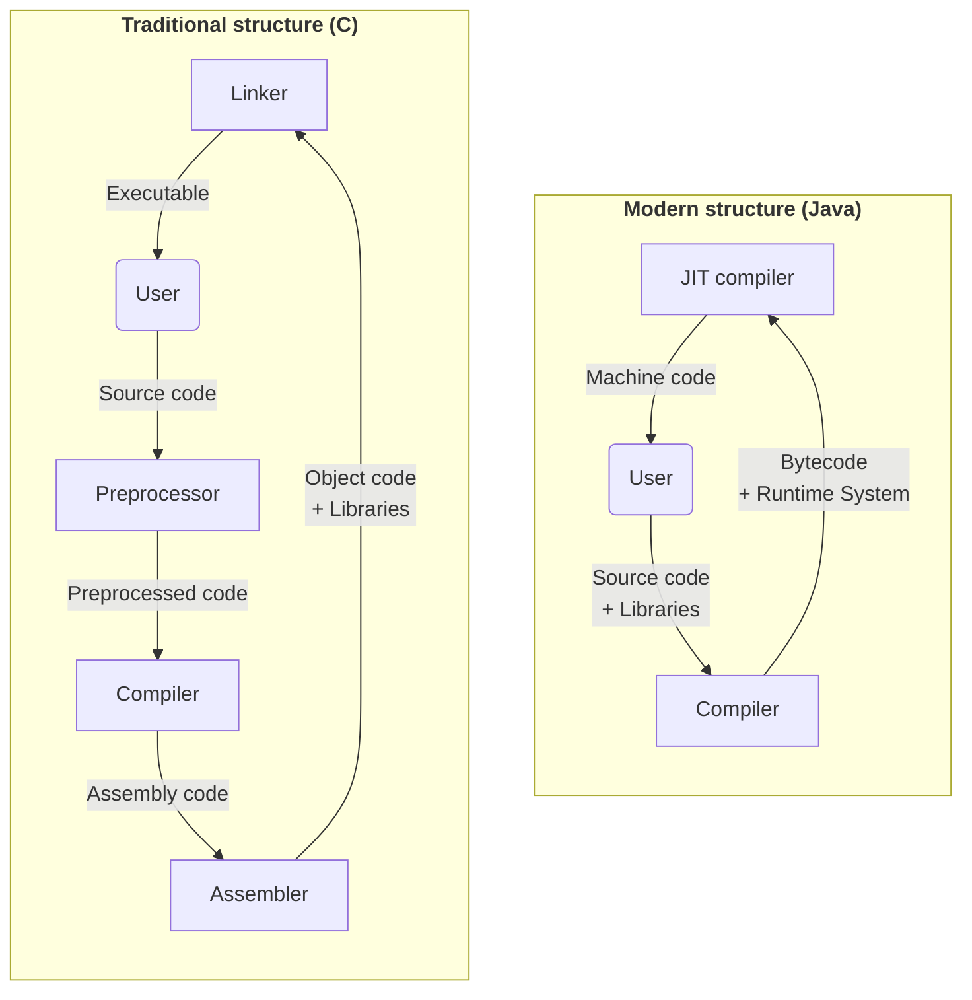

# Introduction

In this topic, we will discover what is a compiler,
how it works, and what are the types of compilers.

**Don't skip this topic**, because it's crucial
to understand the basics of compilers, before
learning about more advanced topics.

## What is a compiler?

<emphasis>Compiler</emphasis> is a computer program that
translates source code written in one programming language
(the source language) into another language (the target language).

<procedure>


</procedure>

**Programming language can be any language**, including
<shortcut>assembly language</shortcut>, <shortcut>machine code</shortcut>, <shortcut>HTML</shortcut>
or even <shortcut>English</shortcut>. _It's just a formal
way to describe a set of instructions_.

## Usage of compilers

Compilers are used in many different areas, including
not only programming languages, but also
web browsers, databases, and even hardware.

<procedure title="Examples">

<step>

**Web browsers** use compilers to compile JavaScript to execute protocols.

</step>

<step>

**Databases** use compilers to compile SQL queries to handle them efficiently.

</step>

<step>

**Hardware** uses compilers to compile hardware description languages to machine code.

</step>

<step>

**Programming languages** use compilers to compile source code to executable files.

</step>

</procedure>

## Types of compilers

There are few types of compilers, which have
different approaches to the compilation process.

### 1. Interpreters

<emphasis>Interpreters</emphasis> are compilers that
reads in source code statement by statement and executes 
them directly.

<procedure>


<tabs>
<snippet id="source-string-tab">
<tab title="Source">

It's usually a string of text,
which is parsed into a sequence of tokens by lexer.

<note>

Also string can be represented as a sequence of characters.

</note>
</tab>
</snippet>
<tab title="Input">

Interpreter reads in command line arguments and input from the user.

Like Python's `input()` function.

```Python
if __name__ == "__main__":
    name = input("Enter your name: ")
```

</tab>
<tab title="Output">

Interpreter prints output to the console.

Like Python's `print()` function.

```Python
if __name__ == "__main__":
    print("Hello, world!")
```

</tab>
</tabs>

</procedure>

<procedure>

**e.g.:** <shortcut>Python</shortcut>, <shortcut>JavaScript</shortcut>, <shortcut>Shell</shortcut>

_(most common case usage is in command line tools and REPLs)._

</procedure>

Interpreters are easy to implement, but they are usually
slower than compilers.

It makes them very efficient **only when only one statement
is processed at a time**.

<tip>

Interpreters don't require any pre-processing, so they
are very convenient to execute on the fly.

</tip>

### 2. Virtual machines

<emphasis>Virtual machines</emphasis> are compilers that
reads in source code and translates it into an intermediate
representation, which is then executed by a virtual machine.

I think that virtual machines are most commonly used
for cross-platform support.

<procedure>


<tabs>
<include from="Compilers-Introduction.md" element-id="source-string-tab"/>
<tab title="Bytecode">

It's a sequence of intermediate instructions,
which is executed by a virtual machine.

<note>

It's called bytecode, because it's usually represented
as a sequence of bytes. But it can be represented in
any other way.

</note>
</tab>
<tab title="Input">

Virtual machine reads in command line arguments and input from the user.

Like Java's `Scanner` class.

```Java
public class Main {
    public static void main(String[] args) {
        Scanner scanner = new Scanner(System.in);
        String name = scanner.nextLine();
    }
}
```

</tab>
<tab title="Output">

Virtual machine prints output to the console.

Like Java's `System.out.println()` function.

```Java
public class Main {
    public static void main(String[] args) {
        System.out.println("Hello, world!");
    }
}
```

</tab>
</tabs>
</procedure>

<procedure>

**e.g.:** <shortcut>Java / Kotlin</shortcut>, <shortcut>Python</shortcut>

</procedure>

Bytecode looks like a machine code, but it still has a high-level constructions, like `if` statements,
`method` calls, etc.

<tip>

Compilers are trying to make bytecode **as finished as possible**,
so virtual machine can execute it as fast as possible:

- Relating definitions and uses of variables
- Type checking if possible
- Translation into control-flow graphs, stack machine code, etc.

It's called <emphasis>high-level optimization</emphasis>.

</tip>

### 3. Standard compilers

<emphasis>Standard compilers</emphasis> are translating
source code into machine code, which is then executed
and can interact with runtime environment.

<procedure>


<tabs>
<include from="Compilers-Introduction.md" element-id="source-string-tab"/>
<tab title="Target Program">

It's a sequence of machine instructions,
which is executed by some specific hardware.

<procedure>

**Targets:**
<shortcut>x86</shortcut>,
<shortcut>ARM</shortcut>,
<shortcut>MIPS</shortcut>,
<shortcut>WebAssembly</shortcut>,
etc.

</procedure>

<note>

Target also specifies the **operating system**, which
is used to execute the program.

</note>

</tab>
<tab title="Input">

Target program reads in command line arguments and input from the user.

Like C's `scanf()` function.

```C
#include <stdio.h>

int main() {
    char name[100];
    scanf("%s", name);
}
```

</tab>
<tab title="Output">

Target program prints output to the console.

Like C's `printf()` function.

```C
#include <stdio.h>

int main() {
    printf("Hello, world!");
}
```

</tab>
</tabs>
</procedure>

This kind of approach, when compiler is compiling
source code into machine code before execution,
is called <emphasis>ahead-of-time compilation</emphasis>.

### 4. Just-in-time compilers

<emphasis>Just-in-time compilers</emphasis> have appeared
relatively recently and have become very popular.
They **compile during program execution**, which makes
them similar to interpreters.

<procedure>

**e.g.:** <shortcut>PyPy</shortcut>, <shortcut>Java</shortcut>,
<shortcut>JavaScript</shortcut>, <shortcut>WebAssembly</shortcut>,
<shortcut>LLVM</shortcut>, etc.

_(nowadays, most of the languages support JIT compilation)._

</procedure>

In difference from interpreters, JIT compilers **don't
execute source code directly**. Instead, they compile
them first and then execute as a machine code.

<tip>

They can optimize machine code **during execution**,
depending on factors like how often a piece of code
is executed, what kind of input it receives, etc.

It also means that JIT compilers often try to assume
some repetitive patterns in the code, which usually
is not possible for standard compilers.

</tip>

### 5. ButterSus's metalanguage compilers

<tip>

Since this is my site, I just want to present my idea.

</tip>

I have an idea of a compiler, which will be able to
**change language itself**. It's called
<emphasis>metaprogramming language</emphasis>.

<procedure>

Nowadays, there are a lot of languages which partially
support metaprogramming, like C++ with its templates,
and `constexpr` functions, or Rust with its macros.

</procedure>

But I want to create a language, which will be able to
fully support **changing syntax and semantics, compile-time
custom code generation, etc.**

Therefore, as its main purpose is to create some
domain-specific languages very easily, it should
also support **easy IDE integration**.

<procedure>

To do so, compiler should be able to **work as
a language server using compile-time concept**:
[dynamic syntax highlighting, code completion, code navigation,
refactoring, warnings and errors (static analysis)](
https://nadeeshaangunasinghe.medium.com/why-use-language-server-aa9bb47207b8)

</procedure>

Frontend can be overriden by the user using some
kind of [Backus-Naur form](https://en.wikipedia.org/wiki/Backus%E2%80%93Naur_form){ignore-vars="true"}.
I'm not sure, but there should be **strict rules, defined by
OOP principles**, in order to structure AST correctly.

All backend stuff should be **implemented
in a language itself**.
It means all logic that generates
and optimizes code should be written in a language itself.
It will allow to **easily extend/override the language**.

<note>

If you are interested in this idea, [you can contact me;
I'm always open for collaboration](Home.md#contact-me) since I'm a student.

</note>

## Compilation process

In modern days, **compilers are usually used in
a pair with other tools**, which makes the compilation
process more complicated.

Let's take a look at the compilation process of
two different languages: <shortcut>C</shortcut> and <shortcut>Java</shortcut>.

<procedure>



</procedure>

<tabs>
<tab title="Traditional structure">

<shortcut>C</shortcut> was written in 1972, when
compilers were used in a completely different way.

<tip>

It was a time when people were mostly using
<shortcut>assembly language</shortcut> and <shortcut>machine code</shortcut>.

</tip>

So, <shortcut>C</shortcut> was designed to work with
<shortcut>assembly language</shortcut> and low-level
environments, like <shortcut>UNIX</shortcut>.

**Most of the approaches, which were used in the past,
are mostly deprecated nowadays.**

</tab>

<tab title="Modern structure">

<shortcut>Java</shortcut> was written in 1995, but
it's still used as a modern language.

<tip>

One of the main features of <shortcut>Java</shortcut>
is that it's cross-platform, which means that it
can be compiled once and then executed on any
target platform.

</tip>

It's not necessarily to use bytecode and JIT
compilation, but it's a common approach nowadays.

</tab>
</tabs>

## Goals of compilers

Originally, compilers were designed to translate
source code into machine code, basically **translating
program from language S to language T**, while
preserving its semantics and thereby **implements S in T**.

<procedure>

Good compilers should also meet the following criteria:

- **Correctness**: The compiler should not change the meaning of the program.
  _(Like any performed optimizations should not change the behavior of the program.)_
- **Efficiency**: The compiler should produce code that is as efficient as possible,
  meaning that it mostly should use less time and memory.
- **Low compilation time**: Not necessarily, but it's better to have a fast compiler.
  For example, it's crucial to have <shortcut>linear time</shortcut> complexity.
- **Compatibility**: The compiler should be compatible with the other compilers
  and tools, which users use _(like IDEs, debuggers, etc.)_.
- **Integration**: Good compiler will provide a good support for developers:
  _nice error messages, debugging tools, etc._

</procedure>

## Structure of compilers

It's nice to have a clear structure of compilers,
which will help us to understand how they work.

<procedure>

Of course, **not all of these steps are required**,
each one can be implemented in a different way.

It's worth to mention, that **each step
can raise an error**.


<tabs>
<tab title="Frontend">

**Frontend** is responsible for the **analysis** of the source code.

It includes:

- **Lexical analysis (Lexing)**: It's a process of converting a sequence of characters
  into a sequence of tokens.
- **Syntax analysis (Parsing)**: It's a process of analyzing the syntax of a program
  and building an abstract syntax tree.
- **Semantic analysis (Analysis)**: It's a process of analyzing the semantics of a program
  and building a symbol table.

Each of these steps is
[**usually independent of each other**](Context-Free-Grammars.md#what-is-a-context-free-grammar).

It's called <emphasis>front-end</emphasis>, because it's the **only part of the compiler,
which affects the syntax and semantics** of the program.

<note>

Note that **frontend doesn't perform any optimizations**.

</note>
</tab>
<tab title="Middle-end">

**Middle end (Transformations)** is a relatively new part of the compiler,
which is responsible for the **transforming of a high-level
representation into a low-level representation**.

As a result, it's **much easier to perform optimizations**.

<note>

Some compilers stop at this stage and produce an
**intermediate representation** (and optimize it).

</note>

Next stages can be done by external tools, such as
<shortcut>LLVM</shortcut>.

</tab>
<tab title="Backend">

**Backend** is responsible for the **generating of the target code**.
It includes:

- **Instruction selection**: It's a process of selecting instructions depending on
  the target architecture.
- **Register allocation**: It's a process of allocating registers,
  which usually requires a lot of analysis.
  _(It's a very complicated topic, as nowadays memory access is much, much slower than CPU operations.)_
- **Instruction scheduling**: It's used for modern CPUs, which have a lot of
  pipelines, like <shortcut>out-of-order execution</shortcut>, <shortcut>branch prediction</shortcut>,

<shortcut>cache memory</shortcut>, etc.

Keep in mind, that **backend has lots of optimizations**,
which are sometimes private and not documented.
And instead of making backend on your own, it's better
to use some existing tools, like <shortcut>LLVM</shortcut>.

<note>

In my opinion, **it's worth trying to implement backend**
on your own, because it's an alluring topic.

</note>

</tab>
</tabs>
</procedure>

<procedure title="Detailed example" collapsible="true">


<tabs>
<tab title="1. Source code">

Let's take a look at the following source code:

```c
res := 2 * in + initial;
```

We will see how it will be compiled into machine code,
as it's a basic example.

</tab>
<tab title="2. Lexical analysis">

First of all, **lexer will split the source code into tokens**,
where each token has its value, type and position.

| Order |    Token     |   Value   | Position |
|:-----:|:------------:|:---------:|----------|
|   1   | `identifier` |   `res`   | `0:2`    |
|   2   |  `operator`  |   `:=`    | `4:5`    |     
|   3   |   `number`   |    `2`    | `7:7`    |
|   4   |  `operator`  |    `*`    | `9:9`    |
|   5   | `identifier` |   `in`    | `11:12`  |
|   6   |  `operator`  |    `+`    | `14:14`  |
|   7   | `identifier` | `initial` | `16:22`  |
|   8   |  `operator`  |    `;`    | `23:23`  |

As you can see, **lexer doesn't care about spaces**;
it just ignores them.
(But it's not always the case)

</tab>
<tab title="3. Syntax analysis">

Then, **parser will build an abstract syntax tree**.
The lower the node is, the more priority it has.

<note>

Multiplication has a higher precedence than addition,
and it's defined in the grammar.

</note>
</tab>
<tab title="4. Semantic analysis">

After that, **semantic analyzer will build a symbol table**,
which will contain all the information about variables.

<tip>

Besides that, semantics also check types of the expressions,
and it's called <emphasis>type checking</emphasis>.

</tip>

But still, **most of the information is still
contained in the Abstract Syntax Tree**,
and symbol table is just a helper.

</tab>
<tab title="5. Transformation">

Then, **middle-end will transform the AST** into
a more convenient representation, which is called
<emphasis>IR code</emphasis>.

```
t1 = inttofloat 2
t2 = load in
t3 = mul t1 t2
t4 = load initial
t5 = add t3 t4
store t5 res
```

This is staged, where **code is almost can be executed (by interpreter)**,
but it's not optimized yet.

</tab>
<tab title="6. Optimization">

After that, **middle-end will optimize the IR code**.

```
t2 = load in
t3 = add t2, t2
t4 = load initial
t5 = add t3, t4
store t5 res
```

As you can see, **some operations were removed, or replaced**
by more efficient ones.

</tab>
<tab title="7. Code generation">

Finally, **backend will generate the target code**.

```
movss in, %xmm0
addss %xmm0, %xmm0
addss initial, %xmm0
movss %xmm0, res
```

Afterward, low-level optimizations will be performed,
like <shortcut>register allocation</shortcut>, <shortcut>instruction scheduling</shortcut>.

<note>

Keep in mind, that **transformation from IR code to target code
is the most complicated part of the compiler**.

</note>

</tab>
</tabs>
</procedure>

## Lexical analysis

<emphasis>Lexical analysis</emphasis> is a process of
**converting a sequence of characters into a sequence of tokens**.
As input it takes a string of text _(source code)_.

<tip>

The goal of lexical analysis is to make the parsing process
a little bit easier.

</tip>

Each <emphasis>token</emphasis> is **meaningful chunk of text**.
The **parser skips some of these tokens**, like
<shortcut>whitespace</shortcut>, <shortcut>comments</shortcut>, etc.

<procedure title="Example">


It's worth mentioning that typically **lexer is implemented
using an iterator style** _(one function that returns the next token)_.

</procedure>

## Syntax analysis

<emphasis>Syntax analysis</emphasis> is a process of
**analyzing the syntax of a program and building an abstract syntax tree**.
As input it takes a sequence of tokens, which are produced by lexer.

<procedure>

It makes the analysis much easier, as now we can travel
through the tree and handle each node separately.


Mention that usually each node is bound to a token,
but it's not always the case.

</procedure>

<tip>

In contrast to the <emphasis>concrete syntax tree</emphasis>,
**the AST can ignore some tokens**, like punctuation tokens _(like `;`)_.

</tip>

## Semantic analysis

<emphasis>Semantic analysis</emphasis> is a process of
**analyzing the semantics of a program and building a symbol table**.

<tip>

Also, tasks of semantic analysis depend on the language,
and can be different.
For example, in <shortcut>Java</shortcut>
it's also handling <shortcut>access modifiers</shortcut>.

</tip>

This step is crucial, as it's responsible for
**type checking** and **variable scoping**.
So it **extends the AST** with additional information.

<procedure>


As you can see, now **each name is referenced** to a specific
declaration, and each **declaration has its type**.

</procedure>

## Transformation Phase

<emphasis>Transformation phase</emphasis> is a process of
**transforming the attributed AST into intermediate representation**.

<tip>

The goal is to _boil down_ the **AST into a more low-level
format**, which will be easier to optimize.

The format is usually called <emphasis>Intermediate Representation</emphasis>.

</tip>

Sometimes, **transformation phase is skipped** in older compilers,
and they just generate machine code directly.

<procedure title="Implementations" collapsible="true">

- **control structures**: `if`, `while`, `for`, etc. are unrolled in

<shortcut>ASM</shortcut>-like code _(using labels, jumps, etc.)_.

- **operators**: `+`, `-`, `*`, `/`, for primitive types are replaced by
  inline assembly instructions _(like `add`, `sub`, `mul`, `div`, etc.)_.

- **functions**: are replaced by `call` and `ret` instructions.

- **classes**: are completely removed, as they are usually can be
  already implemented using functions and structures.

- **arrays**: are replaced by pointers, as they are just a syntactic sugar.

- etc.

</procedure>

<note>

It's not mentioned in the lecture, but I think that
before the transformation phase, there can be
**a step of high-level optimization**, which will
optimize the AST.
_(Optimization levels are not
really classified and have obscure boundaries)_

</note>

### Syntax-Directed Translation

<emphasis>Syntax-directed translation</emphasis> is one of the
most common approaches to the transformation phase, as it's
**very easy to implement**.

<procedure>

Basically, when we are building an IR from AST, we can
**walk through the tree, generating IR code for each node**.


In this example, letters represent nodes _(like statements, if statements, etc.)_,
and generated IR code is represented as a sequence of named pieces _(a1, b1, ...)_.

</procedure>

The only problem is that generated IR code is **very inefficient**.
It's hard to optimize "across" siblings: peephole optimization
to compensate.

<tip>

Early compilers generated ASM like this, today
we build IR this way.

</tip>

### Intermediate Representation Ideas

Assume we want to support `k` source languages and `n` target languages.

<procedure>

Then, we would need to implement `k * n` compilers, which is not
very efficient if we want to support all of them.


But instead, we can implement `k + n` compilers **using universal IR**,
which maybe can affect the performance.

</procedure>

Actually, performance is not a problem, since **most of the optimizations
can be performed on the IR level**.

<procedure>

**e.g.:** <shortcut>LLVM Bitcode</shortcut>, <shortcut>Java Bytecode</shortcut>, <shortcut>WebAssembly</shortcut>, etc.

</procedure>

<tabs>
<tab title="Java Bytecode">
<procedure>

Here's an example of <shortcut>Java-Bytecode</shortcut>:


</procedure>
</tab>
<tab title="LLVM Bitcode">
<procedure>

Here's an example of <shortcut>LLVM Bitcode</shortcut>:


</procedure>
</tab>
</tabs>

## Optimizations

A really nice way to optimize code, depending on the
concrete language semantics, is to **optimize the IR code**.

<procedure>

Optimization has various purposes:

- **Improve performance**: As there are few levels of optimizations,
  some of them can be performed **only with a context of language-specific
  semantics**.
  _([Like inlining in Zig](https://zig.news/edyu/wtf-is-zig-comptime-and-inline-257b),
  optimizations in this step are often called <emphasis>middle-level optimizations</emphasis>.)_
- **Prevent programmer bad practices**: In high-level languages, programmers
  are usually not aware of the performance, but more about the readability.
  For example, in <shortcut>C++</shortcut> it's nice to use array items
  with indexes `a[i + 1]`, but it's not very efficient, as we need to
  calculate the address of the item every time.
- **Remove overhead from language abstractions**: Some language abstractions
  that have been compiled into IR code by syntax-directed translation may
  have some overhead, which can be removed by optimizations.
  _(mostly it's the common case for OOP languages)_
- **Separation of concerns**: Some optimizations can be performed in several steps.
  This is done to make compiler development simpler and more structured.

</procedure>

<tip>

Some optimizations are **language-specific**,
and some of them are **language-independent**.

Ones that are language-independent are usually implemented
in the <shortcut>LLVM</shortcut> compiler.

</tip>

<procedure title="Example 1" collapsible="true">

In this example, we will see how the following code in <shortcut>C</shortcut>:


The code is not very efficient, as it's using pointers, `memcpy`, etc.
But it doesn't matter, as **the compiler will optimize it, as it knows
all parameters and their types** at compile time.

</procedure>

<procedure title="Example 2" collapsible="true">

Again, let's take a look at the following code in <shortcut>C</shortcut>:


There we're using loop optimization. However, this optimization is included
in the <shortcut>LLVM</shortcut> compiler, so we don't need to implement it.

</procedure>

<procedure title="Example 3" collapsible="true">

Sometimes, optimizations are **really dependent on the target machine**.
In this example, we will see how cache memory can affect the performance.


As you can see, **right code is much more efficient**.

This is because **reading in a row is much faster than reading in a column**,
as it's much more cache-friendly.


Below is a more detailed explanation.

</procedure>

<procedure title="List of optimizations" collapsible="true">

There are some common optimizations, which are usually implemented in compilers:


</procedure>

## Modern challenges

Nowadays compilers are used in many different areas,
it's much more complicated than it was before.

<tabs>
<tab title="Challenges I">
<procedure>
<step>

**Compile time has to be sub-quadratic** for the common case.
It usually means that <shortcut>compilation time should be linear</shortcut> or at least
less than quadratic.

```tex
T(n) \in \Theta(n^2) \Leftrightarrow \left[\,\begin{aligned}
&T(n) \in O(n)& \\
&T(n) \in O(n\cdot log_2(n))& \\
&\ldots&
\end{aligned}\right.-\text{nice time complexity}
```

</step>
<step>

**Most relevant code generation problems are NP-hard**.
It means that <shortcut>most of the optimizations are not possible to be solved
in polynomial time</shortcut>.
_(It's a very complicated topic, if you are not familiar with it,
you can read about it [here](https://en.wikipedia.org/wiki/NP-hardness){ignore-vars="true"}.)_

</step>
<step>

**Target machines have resource constraints**.
We should find a balance between <shortcut>performance,
memory usage and compilation time</shortcut>,
which also leads to the previous problems.

</step>
</procedure>
</tab>
<tab title="Challenges II">
<procedure>
<step>

**Target machines are heterogeneous**.
It means that architectures are different, nowadays,
we have <shortcut>multicore CPUs</shortcut>, <shortcut>GPUs.</shortcut>
<shortcut>TPUs</shortcut>, <shortcut>ASICs</shortcut>, etc. _Some
of features are private and not documented, such as <shortcut>branch prediction</shortcut>,
<shortcut>cache memory</shortcut>, <shortcut>out-of-order execution</shortcut>, etc._

**It's often impossible to give a precise notion of _"optimality"_ with
respect to the quality of the code**. We, as compiler developers,
should also worry about language design, as it's crucial for
the readability of the code.

</step>
<step>

**End of Dennard scaling**.
I'm not sure what authors meant by this _(it was mentioned in the lecture)_.

But I think that it's about the fact that
<shortcut>CPU frequency is not increasing anymore</shortcut>,
and we should find a way to make our code more efficient.

</step>
</procedure>
</tab>
</tabs>

## Next topics

Thanks for reading this topic!
I hope you enjoyed it.
[Contact me if you have any suggestions or questions about this topic](Home.md#contact-me).

I'm planning to write more topics about compilers, so stay tuned!
In the next topic, we will learn about
[**Lexical Analysis**](Compilers-Lexical-Analysis.md).
