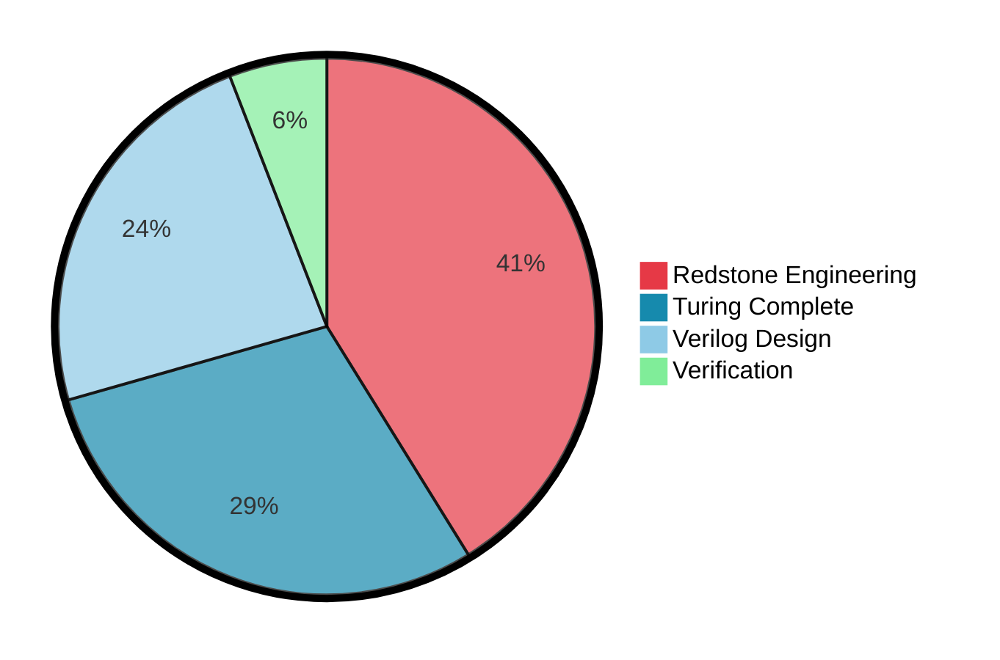

# Цифровая схемотехника

В этой секции я буду делиться опытом работы
с цифровой схемотехникой.

## Про себя

На текущий момент я стараюсь развиваться в двух направлениях:
- [Verilog Design](#verilog-design) - за
- [SystemVerilog Verification](#systemverilog-verification) - за

## Школа синтеза цифровых схем

[chip-design-school]: https://engineer.yadro.com/chip-design-school/

C 2023 года я начал проходить курс
в [школе синтеза цифровых схем][chip-design-school].

## Verilog Design

## SystemVerilog Verification

