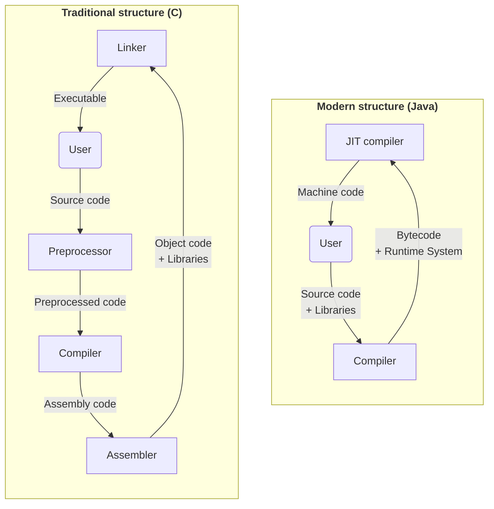

# Introduction

## What is a compiler?

<emphasis>Compiler</emphasis> is a computer program that
translates source code written in one programming language
(the source language) into another language (the target language).

<procedure>


</procedure>

**Programming language can be any language**, including
<shortcut>assembly language</shortcut>, <shortcut>machine code</shortcut>, <shortcut>HTML</shortcut>
or even <shortcut>English</shortcut>. _It's just a formal
way to describe a set of instructions_.

## Usage of compilers

Compilers are used in many different areas, including
not only programming languages, but also
web browsers, databases, and even hardware.

<procedure title="Examples">

<step>

**Web browsers** use compilers to compile JavaScript to execute protocols.

</step>

<step>

**Databases** use compilers to compile SQL queries to handle them efficiently.

</step>

<step>

**Hardware** uses compilers to compile hardware description languages to machine code.

</step>

<step>

**Programming languages** use compilers to compile source code to executable files.

</step>

</procedure>

## Types of compilers

There are few types of compilers, which have
different approaches to the compilation process.

### 1. Interpreters

<emphasis>Interpreters</emphasis> are compilers that
reads in source code statement by statement and executes 
them directly.

<procedure>


<tabs>
<snippet id="source-string-tab">
<tab title="Source">

It's usually a string of text,
which is parsed into a sequence of tokens by lexer.

<note>

Also string can be represented as a sequence of characters.

</note>
</tab>
</snippet>
<tab title="Input">

Interpreter reads in command line arguments and input from the user.

Like Python's `input()` function.

```Python
if __name__ == "__main__":
    name = input("Enter your name: ")
```

</tab>
<tab title="Output">

Interpreter prints output to the console.

Like Python's `print()` function.

```Python
if __name__ == "__main__":
    print("Hello, world!")
```

</tab>
</tabs>

</procedure>

<procedure>

**e.g.:** <shortcut>Python</shortcut>, <shortcut>JavaScript</shortcut>, <shortcut>Shell</shortcut>

_(most common case usage are in command line tools and REPLs)._

</procedure>

Interpreters are easy to implement, but they are usually
slower than compilers.

It makes them very efficient **only when only one statement
is processed at a time**.

<tip>

Interpreters don't require any pre-processing, so they
are very convenient to execute on the fly.

</tip>

### 2. Virtual machines

<emphasis>Virtual machines</emphasis> are compilers that
reads in source code and translates it into an intermediate
representation, which is then executed by a virtual machine.

I think, that virtual machines are most commonly used
for cross-platform support.

<procedure>


<tabs>
<include from="Introduction.md" element-id="source-string-tab"/>
<tab title="Bytecode">

It's a sequence of intermediate instructions,
which is executed by a virtual machine.

<note>

It's called bytecode, because it's usually represented
as a sequence of bytes. But it can be represented in
any other way.

</note>
</tab>
<tab title="Input">

Virtual machine reads in command line arguments and input from the user.

Like Java's `Scanner` class.

```Java
public class Main {
    public static void main(String[] args) {
        Scanner scanner = new Scanner(System.in);
        String name = scanner.nextLine();
    }
}
```

</tab>
<tab title="Output">

Virtual machine prints output to the console.

Like Java's `System.out.println()` function.

```Java
public class Main {
    public static void main(String[] args) {
        System.out.println("Hello, world!");
    }
}
```

</tab>
</tabs>
</procedure>

<procedure>

**e.g.:** <shortcut>Java / Kotlin</shortcut>, <shortcut>Python</shortcut>

</procedure>

Bytecode looks like a machine code, but it's still
has a high-level constructions, like `if` statements,
`method` calls, etc.

<tip>

Compilers are trying to make bytecode **as finished as possible**,
so virtual machine can execute it as fast as possible:

- Relating definitions and uses of variables
- Type checking if possible
- Translation into control-flow graphs, stack machine code, etc.

It's called <emphasis>high-level optimization</emphasis>.

</tip>

### 3. Standard compilers

<emphasis>Standard compilers</emphasis> are translating
source code into machine code, which is then executed
and can interact with runtime environment.

<procedure>


<tabs>
<include from="Introduction.md" element-id="source-string-tab"/>
<tab title="Target Program">

It's a sequence of machine instructions,
which is executed by some specific hardware.

<procedure>

**Targets:**
<shortcut>x86</shortcut>,
<shortcut>ARM</shortcut>,
<shortcut>MIPS</shortcut>,
<shortcut>WebAssembly</shortcut>,
etc.

</procedure>

<note>

Target also specifies the **operating system**, which
is used to execute the program.

</note>

</tab>
<tab title="Input">

Target program reads in command line arguments and input from the user.

Like C's `scanf()` function.

```C
#include <stdio.h>

int main() {
    char name[100];
    scanf("%s", name);
}
```

</tab>
<tab title="Output">

Target program prints output to the console.

Like C's `printf()` function.

```C
#include <stdio.h>

int main() {
    printf("Hello, world!");
}
```

</tab>
</tabs>
</procedure>

This kind of approach, when compiler is compiling
source code into machine code before execution,
is called <emphasis>ahead-of-time compilation</emphasis>.

### 4. Just-in-time compilers

<emphasis>Just-in-time compilers</emphasis> have appeared
relatively recently and have become very popular.
They **compile during program execution**, which makes
them similar to interpreters.

<procedure>

**e.g.:** <shortcut>PyPy</shortcut>, <shortcut>Java</shortcut>,
<shortcut>JavaScript</shortcut>, <shortcut>WebAssembly</shortcut>,
<shortcut>LLVM</shortcut>, etc.

_(nowadays, most of the languages support JIT compilation)._

</procedure>

In difference from interpreters, JIT compilers **don't
execute source code directly**. Instead, they compile
them first and then execute as a machine code.

<tip>

They can optimize machine code **during execution**,
depending on factors like how often a piece of code
is executed, what kind of input it receives, etc.

It also means, that JIT compilers often try to assume
some repetitive patterns in the code, which usually
is not possible for standard compilers.

</tip>

## Compilation process

In modern days, **compilers are usually used in
pair with other tools**, which makes compilation
process more complicated.

Let's take a look at the compilation process of
two different languages: <shortcut>C</shortcut> and <shortcut>Java</shortcut>.

<procedure>



</procedure>

<tabs>
<tab title="Traditional structure">

<shortcut>C</shortcut> was written in 1972, when
compilers were used in a completely different way.

<tip>

It was a time, when people were mostly using
<shortcut>assembly language</shortcut> and <shortcut>machine code</shortcut>.

</tip>

So, <shortcut>C</shortcut> was designed to work with
<shortcut>assembly language</shortcut> and low-level
environments, like <shortcut>UNIX</shortcut>.

**Most of the approaches, which were used in the past,
are mostly deprecated nowadays.**

</tab>

<tab title="Modern structure">

<shortcut>Java</shortcut> was written in 1995, but
it's still used as a modern language.

<tip>

One of the main features of <shortcut>Java</shortcut>
is that it's cross-platform, which means that it
can be compiled once and then executed on any
target platform.

</tip>

It's not necessarily to use bytecode and JIT
compilation, but it's a common approach nowadays.

</tab>
</tabs>
